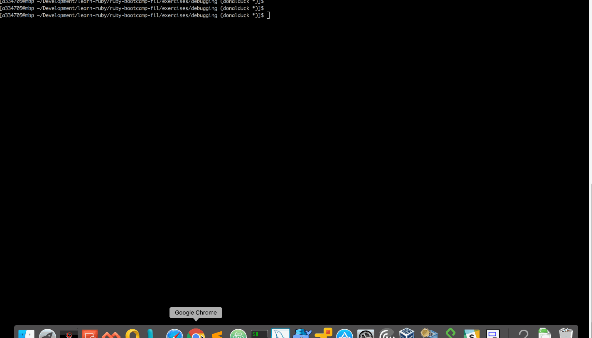

# Debugging


## Introduction

On a daily basis you will most likely use your IDE to debug code. However, early on in the course we won't be using the IDE so it's good to know a few things about how to debug your code during the early exercises.


## Objective

Use `pry-debug` to stop at will within your code to see what's going on and inspect the environment.


## Tasks

**Note:** If you have done so already, you will need to install `pry-debug` and `pry-doc` by running:

```
gem install pry-byebug pry-doc
```

### Task 1

Using the `pry-debug` in [`debug_me.rb`](debug_me.rb)

* Find out what order the people have been shuffled into before they are printed to screen
* Look inside one of the objects representing John, David or Matz. Can you find the attribute that holds the data? 
* What’s the name of it?
* What’s the class of that object?

Please find below the process to debug and answers to above question


### Task 2

Find three methods within `pry` and share them with fellow candidates. Find useful use cases for your findings.
```
- cd 
- methods
- to_yaml
```
